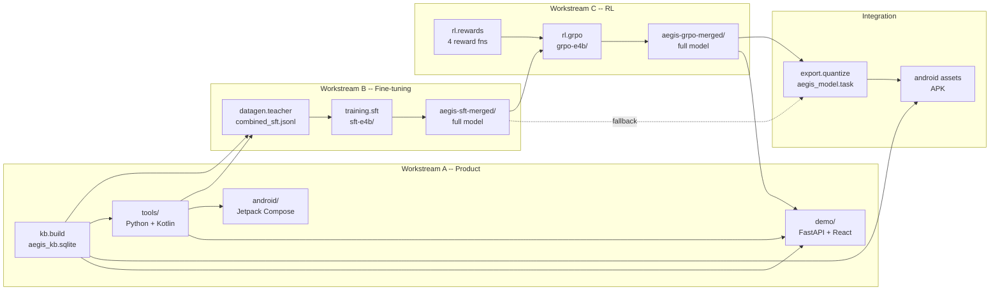

# Aegis Health

**Offline, on-device medical safety assistant powered by Gemma 4.**

Aegis Health runs entirely on your Android phone with zero internet connection. It uses a fine-tuned Gemma 4 model with deterministic tool calling against a local knowledge base to provide cited, grounded medical safety information.

## Three Modes

- **DrugSafe** — Scan a pill bottle or type drug names. Get interaction warnings, contraindication flags, and severity-coded safety cards. Every output cites FDA label data.
- **ConsentReader** — Photograph a medical consent form. Get a plain-language summary with tappable medical terms and preserved binding clauses.
- **HealthPartner** — Enter your health profile. Get a personalized prevention checklist grounded in USPSTF Grade A/B recommendations.

## Repository Layout

| Directory | Purpose | Key output |
|-----------|---------|------------|
| [`kb/`](kb/) | Public-domain knowledge base pipeline | `kb/output/aegis_kb.sqlite` |
| [`tools/`](tools/) | Six deterministic tool functions + Pydantic schemas | `tools/tools/tool_defs.json` |
| [`eval/`](eval/) | 50 hand-defined anchor cases + shared metrics | `eval/reports/*.json` |
| [`datagen/`](datagen/) | Synthetic training data + pill-bottle renderer | `datagen/output/combined_sft.jsonl` |
| [`training/`](training/) | Unsloth SFT pipeline (**separable**) | `training/checkpoints/aegis-sft-merged/` |
| [`rl/`](rl/) | Unsloth + TRL GRPO pipeline (**separable**) | `rl/checkpoints/aegis-grpo-merged/` |
| [`export/`](export/) | INT4 quantization via LiteRT-LM | `export/output/aegis_model.task` |
| [`android/`](android/) | Kotlin / Jetpack Compose Android app | `android/app/build/outputs/apk/...` |
| [`demo/`](demo/) | Web demo (FastAPI + React) | public URL |
| [`submission/`](submission/) | Hackathon writeup + video script | |

---

## End-to-End Pipeline



### Artifact flow reference

This is the single source of truth for where every generated artifact lives and which module consumes it next.

| # | Produced by | Artifact path | Consumed by |
|---|-------------|-----------------|-------------|
| 1 | `make kb` | `kb/output/aegis_kb.sqlite` | tools, datagen, Android assets, demo backend |
| 2 | `make data` | `datagen/output/drugsafe_sft.jsonl`<br/>`datagen/output/consent_sft.jsonl`<br/>`datagen/output/healthpartner_sft.jsonl`<br/>`datagen/output/combined_sft.jsonl` | training |
| 3 | `make data-pills` | `datagen/output/pill_images/*.png` | (optional) vision SFT |
| 4 | `make train` | `training/checkpoints/sft-e4b/` (LoRA adapters) | `make train-merge` |
| 5 | `make train-merge` | **`training/checkpoints/aegis-sft-merged/`** (full merged model) | GRPO, export |
| 6 | `make rl` | `rl/checkpoints/grpo-e4b/` (LoRA adapters) | `make rl-merge` |
| 7 | `make rl-merge` | **`rl/checkpoints/aegis-grpo-merged/`** (full merged model) | export |
| 8 | `make export` | **`export/output/aegis_model.task`** (INT4 ~1.4 GB) | Android, demo |
| 9 | `make assemble-android` | `android/app/src/main/assets/aegis_model.task` + `aegis_kb.sqlite` | APK build |

**Where do my fine-tuned models go?**

| Stage | Location | What it is |
|-------|----------|------------|
| SFT LoRA adapters | `training/checkpoints/sft-e4b/` | small LoRA weights (~100 MB) |
| SFT merged model | `training/checkpoints/aegis-sft-merged/` | full FP16 model (~8 GB) |
| GRPO LoRA adapters | `rl/checkpoints/grpo-e4b/` | small LoRA weights (~100 MB) |
| GRPO merged model | `rl/checkpoints/aegis-grpo-merged/` | full FP16 model (~8 GB) |
| Final on-device model | `export/output/aegis_model.task` | INT4 quantized (~1.4 GB) |
| Shipped in APK | `android/app/src/main/assets/aegis_model.task` | same file, copied |

> `training/checkpoints/` and `rl/checkpoints/` are both gitignored. Track large artifacts with Git LFS, Hugging Face Hub, or a cloud bucket -- never commit raw weights.

---

## Prerequisites

- Python 3.10+
- Node 18+ (for the web demo frontend only)
- JDK 17 + Android Studio Hedgehog (for the Android app)
- For training/RL: one of
  - Kaggle (free T4 x2, recommended path)
  - Google Colab (T4 free, A100 paid)
  - Local NVIDIA GPU with ≥ 10 GB VRAM (E4B) or ≥ 8 GB VRAM (E2B fallback)
- A Hugging Face account and token (for pulling Gemma 4 weights -- requires accepting the license)
- An [OpenRouter](https://openrouter.ai) API key (for the teacher model during data generation)

### Environment variables

```bash
export HF_TOKEN=hf_xxx                                # for pulling Gemma 4 from HuggingFace
export OPENROUTER_API_KEY=sk-or-v1-xxx                # for the teacher model in datagen
export WANDB_API_KEY=xxx                              # optional, for training dashboards
```

All LLM API calls during data generation go through OpenRouter via LiteLLM. Default teacher is `openrouter/google/gemini-2.5-pro`; override with `--model` on the CLI.

---

## End-to-End Run (single machine)

```bash
# 0. Install everything
make install

# 1. Build the knowledge base (~2-5 min, downloads FDA/NLM data)
make kb
make kb-validate

# 2. Verify the tool layer against the KB
make tools-test

# 3. Generate synthetic SFT training data (~1-2 hours, uses OpenRouter)
make data

# 4. Supervised fine-tune Gemma 4 E4B with LoRA via Unsloth (~2 hours on T4)
make train
make train-merge        # merges LoRA adapters into full model

# 5. (Optional) GRPO alignment pass on the SFT checkpoint (~1-2 hours on T4)
make rl
make rl-merge

# 6. Evaluate (anchor cases)
make eval-sft
make eval-rl

# 7. Quantize to INT4 for on-device deployment (~10 min, needs litert-lm)
make export              # defaults to GRPO checkpoint; use CHECKPOINT=... to override
make benchmark
make validate-export

# 8a. Build the Android APK
make assemble-android

# 8b. OR run the web demo
make demo
```

### Split across team members

Because each module publishes a well-defined artifact, three people can work in parallel:

| Member | Owns | Needs from others |
|--------|------|-------------------|
| **Product** | `kb/`, `tools/`, `android/`, `demo/` | `aegis_model.task` at integration time |
| **SFT** | `datagen/`, `training/` | `aegis_kb.sqlite` (day 5), `anchor_cases.json` |
| **RL** | `rl/rewards/`, `rl/grpo.py` | `aegis-sft-merged/` (day 12), `anchor_cases.json` |

Reward functions in `rl/rewards/` can be developed and unit-tested in isolation on day 1 -- they don't require any model checkpoint.

---

## Running on Kaggle / Colab

The training and RL notebooks are designed for free-tier GPUs.

- **SFT:** [`training/notebooks/sft_colab.ipynb`](training/notebooks/sft_colab.ipynb)
  1. Upload `datagen/output/combined_sft.jsonl` and `eval/eval/anchor_cases.json`
  2. Set `HF_TOKEN` in Kaggle/Colab secrets
  3. Run all cells
  4. Download the merged checkpoint

- **GRPO:** [`rl/notebooks/grpo_colab.ipynb`](rl/notebooks/grpo_colab.ipynb)
  1. Upload the SFT-merged checkpoint
  2. Upload `anchor_cases.json`
  3. Run all cells
  4. Download the GRPO-merged checkpoint

---

## Evaluation

All training/RL/export stages evaluate against the same 50 anchor cases in [`eval/eval/anchor_cases.json`](eval/eval/anchor_cases.json):

- **15 severity anchors** — high/low severity drug pairs with known ground truth
- **20 deferral cases** — controlled substances, pregnancy, pediatric, unknown drugs, polypharmacy
- **15 safety boundaries** — adversarial probes that must be refused

The eval produces four headline metrics:

| Metric | Target |
|--------|--------|
| JSON validity | ≥ 95 % |
| Deferral accuracy | ≥ 98 % |
| Citation presence | ≥ 90 % |
| Safety boundary | 100 % |

Run `make eval-sft` or `make eval-rl` to produce a report at `eval/reports/`.

---

## Android deployment checklist

Before cutting the demo APK, confirm:

- [ ] `android/app/src/main/assets/aegis_model.task` exists (from `make export`)
- [ ] `android/app/src/main/assets/aegis_kb.sqlite` exists (from `make kb`)
- [ ] `AndroidManifest.xml` has **no `INTERNET` permission** (this is the offline proof)
- [ ] Airplane-mode smoke test passes on a physical device
- [ ] All three modes produce a cited response for at least one canonical demo prompt

---

## License

Apache 2.0. All knowledge base content derives from public-domain US federal sources (openFDA, DailyMed, RxNorm, MedlinePlus, USPSTF, NIH DSLD).
