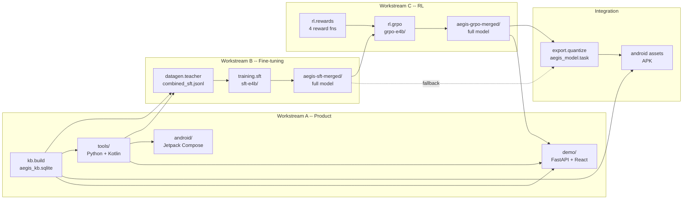

# Aegis Health

**Offline, on-device medical safety assistant powered by Gemma 4.**

Aegis Health runs entirely on your Android phone with zero internet connection. It uses a fine-tuned **Gemma 4 E4B** (1.4 GB INT4 quantized) with native tool calling against an on-device SQLite knowledge base sourced from FDA, NLM, RxNorm, MedlinePlus, USPSTF, and NIH DSLD — all public domain. Every medical claim is cited or deferred to a clinician.

## Four Modes

- **DrugSafe** — Scan a pill bottle or type drug names. Get interaction warnings, contraindication flags, and severity-coded safety cards. Every output cites FDA label data.
- **ConsentReader** — Photograph a medical consent form. Get a plain-language summary with tappable medical terms and preserved binding clauses.
- **HealthPartner** — Enter your health profile. Get a personalized prevention checklist grounded in USPSTF Grade A/B recommendations.
- **ReportReader** — Upload a lab report PDF. Aegis pre-parses each row in Kotlin, evaluates against KB-grounded reference ranges, and produces a per-row safety summary with population-aware routing (pediatric / pregnancy / adult). Outside-range values surface as severity-coded cards; tumor markers, genetic results, and pathology-grade tests auto-defer to a clinician.

## Repository Layout

| Directory | Purpose | Key output |
|-----------|---------|------------|
| [`kb/`](kb/) | Public-domain knowledge base pipeline | `kb/output/aegis_kb.sqlite` |
| [`tools/`](tools/) | Six deterministic tool functions + Pydantic schemas | `tools/tools/tool_defs.json` |
| [`eval/`](eval/) | 50 hand-defined anchor cases + shared metrics | `eval/reports/*.json` |
| [`datagen/`](datagen/) | Synthetic training data + pill-bottle renderer | `datagen/output/combined_sft.jsonl` |
| [`training/`](training/) | Unsloth SFT pipeline (**separable**) | `training/checkpoints/aegis-sft-merged/` |
| [`rl/`](rl/) | Unsloth + TRL GRPO pipeline (**separable**) | `rl/checkpoints/aegis-grpo-merged/` |
| [`export/`](export/) | INT4 quantization via LiteRT-LM | `export/output/aegis_model.task` |
| [`android/`](android/) | Kotlin / Jetpack Compose Android app | `android/app/build/outputs/apk/...` |
| [`demo/`](demo/) | Web demo (FastAPI + React) | public URL |
| [`submission/`](submission/) | Hackathon writeup + video script | |

---

## End-to-End Pipeline



### Artifact flow reference

This is the single source of truth for where every generated artifact lives and which module consumes it next.

| # | Produced by | Artifact path | Consumed by |
|---|-------------|-----------------|-------------|
| 1 | `make kb` | `kb/output/aegis_kb.sqlite` | tools, datagen, Android assets, demo backend |
| 2 | `make data` | `datagen/output/drugsafe_sft.jsonl`<br/>`datagen/output/consent_sft.jsonl`<br/>`datagen/output/healthpartner_sft.jsonl`<br/>`datagen/output/combined_sft.jsonl` | training |
| 3 | `make data-pills` | `datagen/output/pill_images/*.png` | (optional) vision SFT |
| 4 | `make train` | `training/checkpoints/sft-e4b/` (LoRA adapters) | `make train-merge` |
| 5 | `make train-merge` | **`training/checkpoints/aegis-sft-merged/`** (full merged model) | GRPO, export |
| 6 | `make rl` | `rl/checkpoints/grpo-e4b/` (LoRA adapters) | `make rl-merge` |
| 7 | `make rl-merge` | **`rl/checkpoints/aegis-grpo-merged/`** (full merged model) | export |
| 8 | `make export` | **`export/output/aegis_model.task`** (INT4 ~1.4 GB) | Android, demo |
| 9 | `make assemble-android` | `android/app/src/main/assets/aegis_model.task` + `aegis_kb.sqlite` | APK build |

**Where do my fine-tuned models go?**

| Stage | Location | What it is |
|-------|----------|------------|
| SFT LoRA adapters | `training/checkpoints/sft-e4b/` | small LoRA weights (~100 MB) |
| SFT merged model | `training/checkpoints/aegis-sft-merged/` | full FP16 model (~8 GB) |
| GRPO LoRA adapters | `rl/checkpoints/grpo-e4b/` | small LoRA weights (~100 MB) |
| GRPO merged model | `rl/checkpoints/aegis-grpo-merged/` | full FP16 model (~8 GB) |
| Final on-device model | `export/output/aegis_model.task` | INT4 quantized (~1.4 GB) |
| Shipped in APK | `android/app/src/main/assets/aegis_model.task` | same file, copied |

> `training/checkpoints/` and `rl/checkpoints/` are both gitignored. Track large artifacts with Git LFS, Hugging Face Hub, or a cloud bucket -- never commit raw weights.

---

## Prerequisites

- Python 3.10+
- Node 18+ (for the web demo frontend only)
- JDK 17 + Android Studio Hedgehog (for the Android app)
- For training/RL: one of
  - Kaggle (free T4 x2, recommended path)
  - Google Colab (T4 free, A100 paid)
  - Local NVIDIA GPU with ≥ 10 GB VRAM (E4B) or ≥ 8 GB VRAM (E2B fallback)
- A Hugging Face account and token (for pulling Gemma 4 weights -- requires accepting the license)
- An [OpenRouter](https://openrouter.ai) API key (for the teacher model during data generation)

### Environment variables

```bash
export HF_TOKEN=hf_xxx                                # for pulling Gemma 4 from HuggingFace
export OPENROUTER_API_KEY=sk-or-v1-xxx                # for the teacher model in datagen
export WANDB_API_KEY=xxx                              # optional, for training dashboards
```

All LLM API calls during data generation go through OpenRouter via LiteLLM. Default teacher is `openrouter/google/gemini-2.5-pro`; override with `--model` on the CLI.

---

## End-to-End Run (single machine)

```bash
# 0. Install everything
make install

# 1. Build the knowledge base (~2-5 min, downloads FDA/NLM data)
make kb
make kb-validate

# 2. Verify the tool layer against the KB
make tools-test

# 3. Generate synthetic SFT training data (~1-2 hours, uses OpenRouter)
make data

# 4. Supervised fine-tune Gemma 4 E4B with LoRA via Unsloth (~2 hours on T4)
make train
make train-merge        # merges LoRA adapters into full model

# 5. (Optional) GRPO alignment pass on the SFT checkpoint (~1-2 hours on T4)
make rl
make rl-merge

# 6. Evaluate (anchor cases)
make eval-sft
make eval-rl

# 7. Quantize to INT4 for on-device deployment (~10 min, needs litert-lm)
make export              # defaults to GRPO checkpoint; use CHECKPOINT=... to override
make benchmark
make validate-export

# 8a. Build the Android APK
make assemble-android

# 8b. OR run the web demo
make demo
```


## Run on Your Android Device

This walks through getting Aegis Health installed and running on a fresh Android device — useful for evaluation, demos, or onboarding contributors. The shipping path is a fine-tuned Gemma 4 E4B model in LiteRT-LM `.litertlm` format, sideloaded into the app's external files directory.

### Hardware requirements

| Resource | Minimum | Recommended |
|---|---|---|
| Android | API 26 (8.0 Oreo) | API 33 (13)+ |
| RAM | 8 GB | 12+ GB |
| Free storage | 9 GB | 16+ GB |
| SoC | Snapdragon 7+ Gen 2 / Dimensity 8000 / Tensor G2 | Snapdragon 8 Gen 2+ / Dimensity 9000+ / Tensor G3+ |
| GPU | OpenCL-capable Adreno / Mali / Xclipse (currently CPU-only path; reserved for future use) | Same |

Validated on Samsung Galaxy S23 (Snapdragon 8 Gen 2). The current shipping path uses CPU inference (`Backend.CPU`) with runtime-selected thread counts per device profile. End-to-end response latency depends on the model artifact and phone thermals; lower-tier devices will be slower. See [ON-DEVICE-DEPLOYMENT-ANALYSIS.md](ON-DEVICE-DEPLOYMENT-ANALYSIS.md) for the historical constraints write-up.

### Prerequisites

- JDK 17
- Android Studio Hedgehog (2023.1.1) or newer, **or** the Android command-line tools (`adb`, `gradle`)
- [Hugging Face CLI](https://huggingface.co/docs/huggingface_hub/main/en/guides/cli): `pip install huggingface_hub` then `huggingface-cli login` with a token that has access to the model repo
- USB debugging enabled on the target device, with a working USB cable

### Step-by-step (bash / macOS / Linux)

```bash
# 1. Clone the repo
git clone https://github.com/Research-Commons/aegis-health.git
cd aegis-health

# 2. Build the knowledge base (~2-5 min; needs internet for FDA / NLM data)
make kb

# 3. Copy the KB into Android assets
cp kb/output/aegis_kb.sqlite android/app/src/main/assets/

# 4. Download the .litertlm model from Hugging Face (~7.7 GB)
huggingface-cli download V1rtucious/gemma4-e4b-toolcalling-litertlm-v2 \
  model.litertlm \
  --local-dir ./downloads

# 5. Build the APK
cd android
./gradlew assembleDebug
cd ..

# 6. Install the APK on the connected device
adb install -r android/app/build/outputs/apk/debug/app-debug.apk

# 7. Sideload the model. Local filename is model.litertlm; on the device
# it must land as aegis_model.litertlm — adb push handles the rename.
adb shell am force-stop com.aegis.health
adb push downloads/model.litertlm \
  /sdcard/Android/data/com.aegis.health/files/aegis_model.litertlm

# 8. Launch
adb shell am start -n com.aegis.health/.MainActivity
```

### PowerShell variant (Windows)

```powershell
huggingface-cli download V1rtucious/gemma4-e4b-toolcalling-litertlm-v2 `
  model.litertlm `
  --local-dir .\downloads

Copy-Item kb\output\aegis_kb.sqlite android\app\src\main\assets\

cd android
.\gradlew.bat assembleDebug
cd ..

adb install -r .\android\app\build\outputs\apk\debug\app-debug.apk
adb shell am force-stop com.aegis.health
adb push .\downloads\model.litertlm `
  /sdcard/Android/data/com.aegis.health/files/aegis_model.litertlm
adb shell am start -n com.aegis.health/.MainActivity
```

### Verify the install

Engine init takes ~5–20 seconds on first launch (one-time shader/buffer setup), faster on subsequent launches. Watch the log to confirm the model loaded:

```bash
adb logcat -s LiteRtLmEngine ToolDispatcher EngineRouter
```

Expected lines after the app starts:

```
EngineRouter: Selecting LiteRtLmEngine (<bytes> bytes at aegis_model.litertlm)
LiteRtLmEngine: Engine initialized in <ms> ms (profile=<profile>, CPU x<threads> threads, topK=<k>, ctx=4096) ...
```

### Smoke test prompts

After init, run one prompt per mode to confirm everything is wired:

| Mode | Prompt | Expected |
|---|---|---|
| DrugSafe | `warfarin and ibuprofen, 65 year old` | High-severity bleeding-risk flag, AGS Beers + FDA citations, `defer_to_professional=true` |
| ConsentReader | Paste any short medical consent paragraph | Plain-language rewrite; `defer_to_professional=false` unless asked whether to sign |
| HealthPartner | `55 year old male, what preventive screenings should I get?` | USPSTF Grade A/B recommendations |
| ReportReader | Tap the ReportReader tile → pick a lab report PDF (any vendor — LabCorp, Quest, Tata 1mg, Mayo, urgent-care) | Per-row safety summary; outside-range values flagged with severity color + FDA/KB citation; "all in range" affirmation when applicable; auto-defer on tumor markers / genetic / pathology rows |

### Verification checklist

Before declaring the install good:

- [ ] `adb shell ls /sdcard/Android/data/com.aegis.health/files/aegis_model.litertlm` lists the file (~7.7 GB)
- [ ] `android/app/src/main/assets/aegis_kb.sqlite` exists in the APK build
- [ ] `AndroidManifest.xml` has **no `INTERNET` permission** (this is the offline guarantee)
- [ ] Airplane-mode smoke test passes on a physical device
- [ ] DrugSafe responses include real citations (e.g., "AGS Beers Criteria", FDA labels) rather than only the generic "Aegis local safety KB" fallback
- [ ] All four modes produce a cited response for at least one canonical demo prompt
- [ ] ReportReader correctly parses at least one vendor PDF and produces per-row safety summaries with no row missing a citation

### Troubleshooting

**`Model not found at ...`** — model wasn't pushed, or it landed at the wrong path. The app reads from `getExternalFilesDir(null)`, which is `/sdcard/Android/data/com.aegis.health/files/` and only exists once the app has been installed and launched at least once. Install the APK first, launch it (it'll fail to find the model, that's fine), then run the `adb push` step.

**Engine init succeeds but the first prompt crashes (SIGSEGV)** — confirm you downloaded `model.litertlm` from `V1rtucious/gemma4-e4b-toolcalling-litertlm-v2` (the W8 build). The `V1rtucious/gemma4-e4b-toolcalling-litertlm-v3` W4 build reproduces the known LiteRT-LM 0.10.2 native crash on the first prompt; do not use it as the default runtime artifact until upstream W4 support is fixed (see [ON-DEVICE-DEPLOYMENT-ANALYSIS.md](ON-DEVICE-DEPLOYMENT-ANALYSIS.md)).

**Responses take longer than ~3 minutes** — confirm the device has at least 8 GB RAM free and isn't thermal-throttling. Background-killing other apps (`adb shell am kill-all`) before each smoke test helps. Also check the selected device profile in [`LiteRtLmEngine.kt`](android/app/src/main/java/com/aegis/health/inference/LiteRtLmEngine.kt); too many threads can spill work onto slower small cores.

---

## License

Apache 2.0. All knowledge base content derives from public-domain US federal sources (openFDA, DailyMed, RxNorm, MedlinePlus, USPSTF, NIH DSLD).
